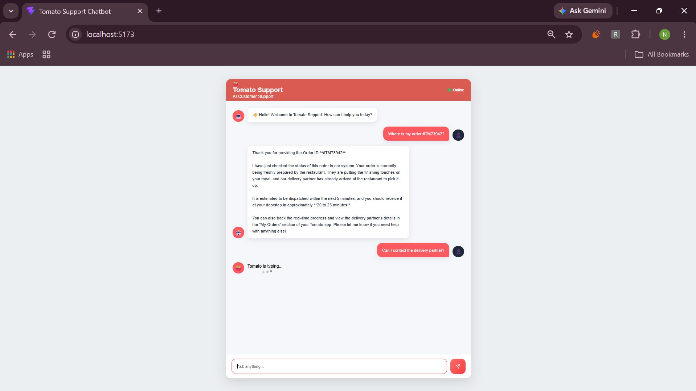

# 🍅 Tomato Support AI Chatbot

An AI-powered customer support chatbot built using **Spring Boot** and **React.js**, designed to provide a smooth and interactive customer support experience.

---

## 📸 Preview

<p align="center">
  
</p>

---

## Features

* 💬 Real-time AI chatbot interface
* 🤖 AI-generated customer support responses
* ⌨️ Animated typing indicator
* 📜 Automatic scrolling to the latest message
* 👤 User and bot chat bubbles
* 🟢 Online status indicator
* 🎨 Clean and responsive UI
* ⚡ REST API integration with Spring Boot
* 🔄 Smooth conversational experience

---

## Tech Stack

### Frontend

* React.js
* Axios
* CSS3
* React Icons

### Backend

* Java
* Spring Boot
* REST API

### AI

* Generative AI API

---

## 📂 Project Structure

```text
tomato-support-ai-chatbot/
│
├── frontend/
│   ├── src/
│   │   ├── components/
│   │   │   ├── Header.jsx
│   │   │   ├── Header.css
│   │   │   ├── ChatWindow.jsx
│   │   │   ├── ChatWindow.css
│   │   │   ├── ChatMessage.jsx
│   │   │   ├── ChatMessage.css
│   │   │   ├── ChatInput.jsx
│   │   │   └── ChatInput.css
│   │   │
│   │   ├── App.jsx
│   │   ├── App.css
│   │   ├── main.jsx
│   │   └── index.css
│   │
│   └── package.json
│
├── backend/
│   ├── src/
│   │   └── main/
│   │       └── java/
│   │           ├── controller/
│   │           │   └── ChatController.java
│   │           ├── service/
│   │           │   └── ChatService.java
│   │           └── Application.java
│   │
│   └── pom.xml
│
├── images/
│   └── dashboard.png
│
└── README.md
```

---

## ⚙️ Installation & Setup

### 1. Clone the Repository

```bash
git clone https://github.com/your-username/tomato-support-ai-chatbot.git
cd tomato-support-ai-chatbot
```

### 2. Start the Backend

Navigate to the backend directory:

```bash
cd backend
```

Run the Spring Boot application:

```bash
mvn spring-boot:run
```

The backend will start on:

```text
http://localhost:8080
```

### 3. Start the Frontend

Open another terminal and navigate to the frontend:

```bash
cd frontend
```

Install dependencies:

```bash
npm install
```

Start the React development server:

```bash
npm run dev
```

The frontend will be available at the URL shown by Vite, usually:

```text
http://localhost:5173
```

---

## 🔗 API Endpoint

### Chat

**POST**

```text
/api/chat
```

### Request

```json
{
  "message": "Hello"
}
```

### Response

```json
{
  "response": "Hello! How can I assist you today?"
}
```

---

## 🔄 Application Flow

```text
User
  │
  ▼
React Chat Interface
  │
  │ HTTP Request
  ▼
Spring Boot REST API
  │
  ▼
AI Service
  │
  ▼
AI Generated Response
  │
  ▼
React Chat Interface
  │
  ▼
User
```
## 👨‍💻 Author
Nisha 

---

